<div align="center">



*Somebody else built a six-agent federation. We read all sixty files and drew the map.*

[](https://github.com/Lexideck-Technologies/Lexideck2026)
[](LICENSE)


[](https://github.com/OpenCnid/axes-of-wonder)

</div>

> **A study repo, not a rival release.** The corpus here is
> **Lexideck Technologies' work** — six Codex custom agents, nineteen portable
> skills, the PTG persona corpus, the export manifest — mirrored with its full
> git history and its GPL-3.0 license intact. We added exactly two things: a
> density-chain map of the corpus and a SPARK-axis diagnosis of it. If you want
> the software, go [upstream](https://github.com/Lexideck-Technologies/Lexideck2026);
> they're the ones who made it.
>
> **One file moved, none edited.** Their `README.md` is preserved verbatim as
> [`UPSTREAM-README.md`](UPSTREAM-README.md) so that this page could explain
> whose work you're looking at before you start reading it. Renamed, not
> rewritten — `git log --follow` shows the whole thing.

> [!IMPORTANT]
> **The one-way rule.** When our map and the upstream corpus disagree, **upstream
> wins** and the map gets fixed. Never the other way around. That rule is the
> only reason a map of someone else's system is worth reading — without it you're
> just reading our opinions with extra steps.

## What's actually here

| path | what it is | whose |
|---|---|---|
| `.agents/skills/` · `.codex/` · `AGENTS.md` · `references/` · `images/` | the corpus, unaltered | **theirs** |
| `LICENSE` · `CONTRIBUTING.md` · `PUBLIC_EXPORT_MANIFEST.md` · `VERSION` | unaltered | **theirs** |
| [`UPSTREAM-README.md`](UPSTREAM-README.md) | their README, verbatim, relocated | **theirs** |
| [`docs/density-chain/DENSITY-CHAIN.md`](docs/density-chain/DENSITY-CHAIN.md) | the map: a trunk plus five fixed-length five-tier chains, every claim located | ours |
| [`docs/density-chain/DENSITY-CHAIN.html`](docs/density-chain/DENSITY-CHAIN.html) | the same map, rendered — click any tier to read it whole | ours |
| [`docs/SPARK-STEERING.md`](docs/SPARK-STEERING.md) | which capability axis this corpus occupies, and which is short | ours |
| `index.json` | the machine face: pins, verification date, branch inventory | ours |

## The map in one screen

Five branches, each a chain of density held at ninety words a tier:

| branch | what it owns | the finding worth clicking for |
|---|---|---|
| **B1 federation** | six personas, the routing contract, the bounds | `max_threads = 6`, `max_depth = 1` — no agent spawns a sub-chain |
| **B2 skills** | nineteen skills, their shape and packaging | the count is asserted three times and **checks out** against the tree |
| **B3 boundary** | the privacy model and export allowlist | six of seven rules verified against bytes; the seventh has no implementation |
| **B4 PTG** | how the six personas were manufactured | one pipeline stage calibrates an input the other never produces |
| **B5 lineage** | descent from a 2025 corpus by the same author | the taxonomy was kept; the pseudo-API was amputated |

If you read one thing, read **B5**. Five of these nineteen skills descend
textually from [WonderSuite 2.0](https://github.com/OpenCnid/axes-of-wonder) —
same axis labels, same primitive signatures — but the entire executable-looking
layer that WonderSuite had grown (a `{Define}`/`{Branch}`/`{Recurse}`/`{Scale}`
pseudo-API, `!bang` commands, CSV lookup schemas) was dropped on the way. The
taxonomy survived; the machinery did not. That's a design decision you can watch
happen across two repositories a year apart.

## 🏔️ Standing on the shoulders of giants

The federation, the nineteen skills, the persona corpus, the ethics gate, and
every idea worth having in this repository are **Matthew Murphy's**, published as
Lexideck Technologies. They designed the personas, wrote the methods, drew the
portraits, and set the publication boundary — including the parts where that
boundary honestly admits its own limits, which is rarer than it should be.

We read it and made a map. Those are very different jobs, and only one of them is
load-bearing.

**Do not cite this repo.** Cite
[the original](https://github.com/Lexideck-Technologies/Lexideck2026), and if you
use the methods, the license that came with them is GPL-3.0-only.

## 📥 Want the original? One command, straight from the source

We don't consider ourselves a distribution channel. Go to the actual one:

```bash
git clone https://github.com/Lexideck-Technologies/Lexideck2026.git
```

## How the map was made

Five read-only sub-agents, one per branch, each starting from an identical
verbatim ground block and returning against a rigid frame: five tiers at a held
word budget, an entity ledger with a locator per entity, a key-facts table, short
attributed quotes, and a mandatory *uncovered* slot so a gap could never be
mistaken for an absence. Siblings could not see one another. The trunk, the
cross-section, and the cross-link lattice were composed afterward from what came
back — no agent adjudicated another's findings, because an agent grading its
neighbor is just a louder agent.

Every claim carries `path:line` into the tree at commit `a1bc8a6`. Nothing was
written from memory; where a number appears, it was read off a file that session.

## Honest notes

- **A map is not a review.** We recorded what the corpus contains and where its
  prose outruns its bytes. We did not judge whether the methods *work* — that's a
  behavioral question and static text cannot answer it.
- **Seven "unbuilt"s is a finding, not an accusation.** Every branch's frontier
  tier reads *unbuilt*, in the repository's own words. A `0.1.0` that is explicit
  about the gap between what it ships and what it intends is being honest. We
  logged the count, not a verdict.
- **The squash costs us the interesting half.** Upstream ships one squashed
  commit, so this corpus cannot be reverse-engineered from its build order. Every
  "when" question has exactly one answer: 2026-07-16. The
  [companion study](https://github.com/OpenCnid/axes-of-wonder) has twelve commits
  and correspondingly better answers.
- **FEV is never defined.** The acronym recurs across `AGENTS.md`, the persona
  files, and `PTG-Corpus.md`, and is expanded nowhere in the tree. We grepped
  exhaustively before saying so, and we're recording it as an observation rather
  than a complaint — every corpus has a word it forgot to introduce.
- **We may be wrong.** When we are, the fix lands upstream-first and the
  correction is public history. If we've mangled your corpus, open an issue —
  correcting the record *is* the project.
- **A human and an AI made this together.** The human picked the repo; the AI
  read all sixty files and kept asking for line numbers.

## License and provenance

Upstream is **GPL-3.0-only**. `LICENSE` is unmodified, the full commit history is
preserved so authorship is verifiable from `git log` rather than from this
paragraph, and no upstream file has been edited. Our additions live entirely
under `docs/`, `assets/`, and `index.json`; the single structural change is the
`README.md` → `UPSTREAM-README.md` rename described above.

A mirror plus commentary. Not a fork seeking to diverge, not a release, and not
an endorsement in either direction.

---

<sub>Studied at OpenCnid · method: <a href="https://github.com/OpenCnid/chain-of-density">chain-of-density</a>, system mode · the bow ties are load-bearing.</sub>
